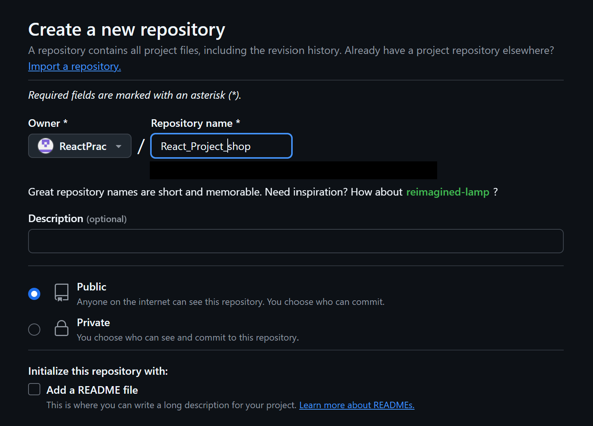
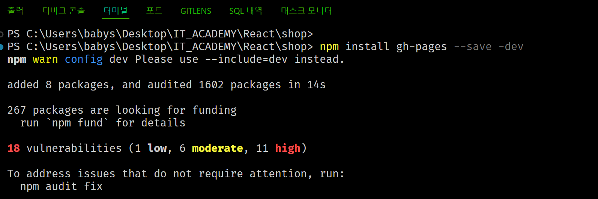
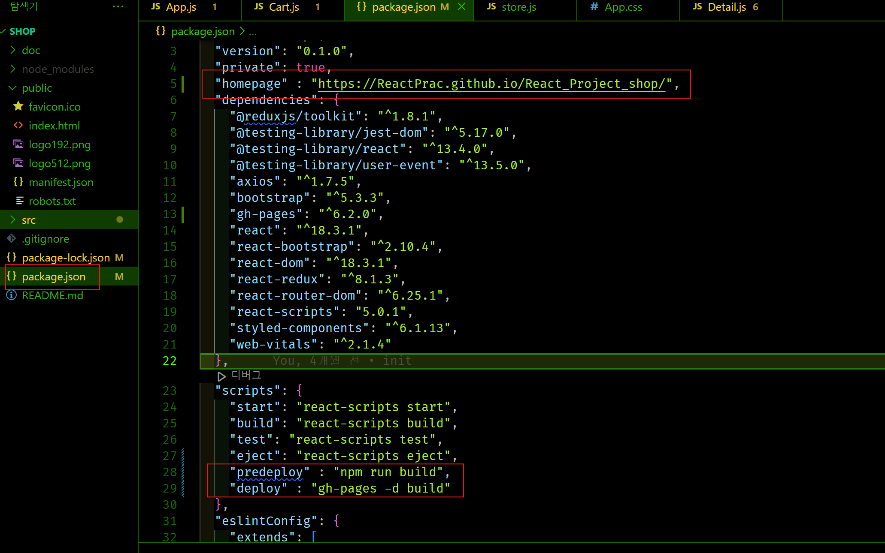
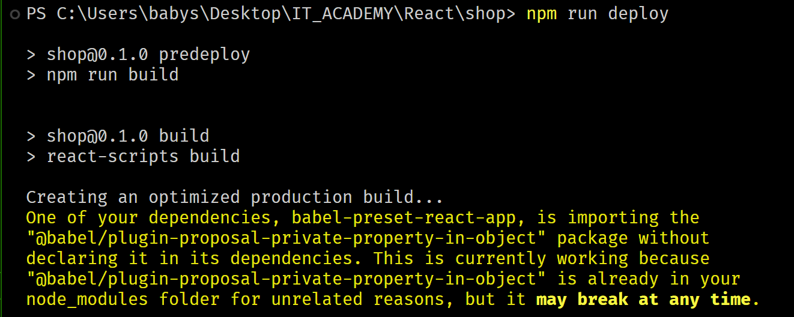

# [Link](https://reactprac.github.io/React_Project_shop/)

---

React + Github
---
> 터미널
```javascript
  npm install gh-pages --save-dev
```

|-|
|-|
||
||
||
|git init ~ git push 까지 완료한 후|
||

<br>
