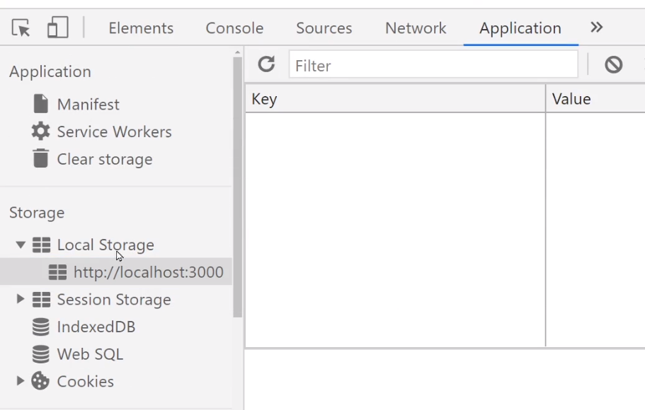

# localStorage
- 새로고침하면 모든 state 데이터는 리셋

    -  새로고침하면 브라우저는 html css js 파일들을 처음부터 다시 읽기 때문

- 리셋 원하지 않으면 state 데이터를 서버로 보내서 DB에 저장 or localStorage 이용

- localStorage : 유저의 브라우저에 정보를 저장하고 싶을 때 쓰는 공간

<br>

|-|
|-|
||
 

- 크롬개발자 도구 Application 탭에서 확인 가능

- 사이트마다 5MB 정도의 문자 데이터를 저장 가능

- object 자료랑 비슷하게 key/value 형태로 저장

- 유저가 브라우저 청소를 하지 않는 이상 영구적으로 남음
 
- Session Storage도 똑같은데 브라우저 끄면 삭제됨
 
<br>

---

<br>
 

localStorage 문법 
---
- js 파일 아무데서나 다음 문법 쓰면 localStorage에 데이터 입출력 가능

> Console or js
```javascript
localStorage.setItem('데이터이름', '데이터');
localStorage.getItem('데이터이름');
localStorage.removeItem('데이터이름')
```
- 차례로 추가, 읽기, 삭제 문법

    - 저장되었는지 application 탭에서 확인

<br>

---

<br>
 

localStorage에 array/object 자료 저장
---
- localStorage : 문자만 저장할 수 있는 공간

    - array/object 바로 저장 불가 

- 강제로 저장해보면 문자로 바꿔서 저장

    - array/object 자료가 깨져서 저장됨

- array/object -> JSON 변환해서 저장

    - JSON은 문자취급을 받음

        - JSON : 따옴표친 array/object 자료 

> js
```javascript
localStorage.setItem('obj', JSON.stringify({name:'kim'}) );
```
- JSON.stringify() 함수에 array/object 입력

    - 그 자리에 JSON으로 변환된 자료 반환

- 위처럼 코드짜면 저장가능

    - "{"name":"kim"}" 형식으로 저장 

<br>

> js
```javascript
var a = localStorage.getItem('obj');
var b = JSON.parse(a)
```
- 데이터를 다시 꺼내면 JSON 나옴

- JSON -> array/object 변환하고 싶으면 

    - JSON.parse() 사용

<br>

---

<br>
 

최근 본 상품 UI 기능 만들기 
---
- 메인페이지에 최근 본 상품을 보여주는 UI 추가

    - 사이트를 재접속해도 잘 보여야하기 때문에 localStorage 활용

- 상세페이지 들어가면 현재 페이지에 있는 상품 id를 localStorage에 저장

    - 저장할 땐 array 자료형 활용

        - 0번 1번 상품을 보았다면 [0,1] 데이터가 localStorage에 저장

- 사이트로 접속시 localStorage에 [ ] 가 하나 있어야 자료 추가 쉬워짐

> App.js
```javascript
function App() {

  useEffect(()=>{
    localStorage.setItem('watched', JSON.stringify( [] ))
  },[]) 

}
```
- 이런코드 하나 넣고 시작하면 편리


<br>

### 1. 누가 Detail 페이지 접속하면 상품번호 가져오기
> Detail.js
```javascript
useEffect(()=>{
  console.log(찾은상품.id)
}, [])
```

<br>

### 2. localStorage에 array 형식으로 보관
- localStorage 의 기존 데이터 수정은 불가능

    - 입력/출력만 가능

- watched 에 있던 [] 빼서 찾은상품.id 추가 후 다시 watched 항목으로 저장

> Detail.js
```javascript
useEffect(()=>{
  let 꺼낸거 = localStorage.getItem('watched')
  꺼낸거 = JSON.parse(꺼낸거)
  꺼낸거.push(찾은상품.id)
  localStorage.setItem('watched', JSON.stringify(꺼낸거))
}, [])
```

<br>

### 3. 중복 제거
- 상품 id가 이미 []에 있으면 추가하지 말라고 작성

    - if문 or Set 자료형

        - Set : array와 똑같은데 중복을 제거해주는 array

            - array <-> Set 변환 쉬움


> Detail.js
```javascript
useEffect(()=>{
  let 꺼낸거 = localStorage.getItem('watched')
  꺼낸거 = JSON.parse(꺼낸거)
  꺼낸거.push(찾은상품.id)

  //Set으로 바꿨다가 다시 array로 만들기
  꺼낸거 = new Set(꺼낸거)
  꺼낸거 = Array.from(꺼낸거)
  localStorage.setItem('watched', JSON.stringify(꺼낸거))
}, [])
```
- Set 으로 바꿨다가 다시 array 변환

    - new Set(array자료) : array -> Set 변환

    - Array.from(Set자료) : Set -> array 변환

<br>

---

<br>

localStorage에 state를 자동저장
---
- redux-persist 라이브러리 설치

    - redux store 안에 있는 state를 자동으로 localStorage에 저장

    - state 변경될 때마다 그에 맞게 localStorage 자동 업데이트

    - 셋팅문법 복잡

- Jotai, Zustand 라이브러리를 사용 

    - Redux와 같은 기능을 제공
    
    - 셋팅 거의 필요없고 문법 간단함


<br>

--- 

<br>

응용사항
---
- 사이트 새로고침시 localStorage에 있던 항목 비워짐

    - App컴포넌트 로드시 [] 새로 넣으라고 작성해둔 상태

- 이미 localStorage에 watched 항목이 있으면 [] 이거 새로 넣지 말라고 코드 작성해보기

 
<br>
 

 
