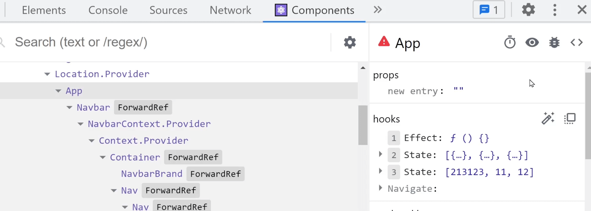
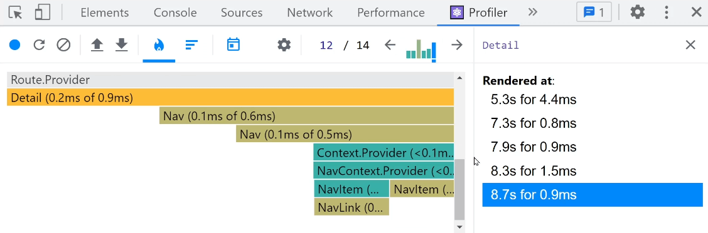

# 성능 개선 1 : 개발자도구 & lazy import
개발자도구
---
- 개발자도구를 켜서 Elements 탭 확인

    - props를 보냈는데 출력이 안되는 버그 발생

    - 이미지를 넣었는데 안보이는 버그 발생

- 작성 코드가 실제 html css로 변환되어서 보여짐

    - 컴포넌트로 미리보고 싶으면 리액트 개발자도구 설치

<br>

---

<br>

크롬 확장프로그램 : React Developer Tools 
---
- [크롬 웹스토어](https://chrome.google.com/webstore/)에서  확장프로그램 설치

- React Developer Tools 설치하면 Components 탭 생성됨

    - 개발중인 리액트사이트를 컴포넌트로 미리볼 수 있음

<br>

|Components 탭|
|-|
||

- 왼쪽에서 컴포넌트구조 파악 가능

- 왼쪽상단 아이콘눌러서 컴포넌트 찍어보면 거기 있는 state, props 조회 가능 

    - 수정해볼 수도 있음 

<br>

---

<br>

Profiler 탭에서 성능평가 가능
---

|Profiler 탭|
|-|
||

- 렌더링된 모든 컴포넌트의 렌더링시간 측정 가능

    - Profiler 탭 들어가서

    - 녹화버튼 누르고

    - 페이지 이동이나 버튼조작을 해보고

    - 녹화 끝내기

- 이상하게 느린 컴포넌트가 있다면 여기서 원인 파악 가능

- \<div>를 수천개 만들거나 그러지 않는 이상 보통은 걱정할 필요 X

- 지연 원인 대부분 : 서버에서 ajax 요청결과가 늦게 도착한 경우 多

    - 서버가 느린 건 어쩔 수 없음 

<br>

---

<br>

Redux Developer Tools 
---
- 크롬 웹스토어에서 설치 가능

- Redux store에 있던 state를 전부 확인 가능

- dispatch 날릴 때 마다 뭐가 어떻게 바뀌었는지 로그 작성해줌

    - store 복잡해지면 유용

<br>

---

<br>

lazy import
---
- 리액트 코드 다 짰으면 npm run build 입력

    - 코드들을 html, css, js 파일로 변환 

- 리액트로 만드는 Single Page Application 특징

    - html, js 파일이 하나만 생성됨

        - 그 안에 지금까지 만든 App / Detail / Cart 모든 내용이 들어있어 파일사이즈 大

        - 그래서 리액트 사이트들은 첫 페이지 로딩속도가 느림

- 그게 싫다면 js 파일을 쪼개기

    - 쪼개는 방법 : import 문법 살짝 바꾸기 


<br>

> App.js
```javascript
import Detail from './routes/Detail.js'
import Cart from './routes/Cart.js'
```
- 메인페이지 보면 Detail, Cart를 import 

- Detail, Cart 컴포넌트는 메인페이지에서 전혀 보이지 않음

    - 이런 컴포넌트들은 아래 문법으로 import

<br>

> App.js
```javascript
import {lazy, Suspense, useEffect, useState} from 'react'

const Detail = lazy( () => import('./routes/Detail.js') )
const Cart = lazy( () => import('./routes/Cart.js') )
```
- lazy 문법으로 import

    - `Detail 컴포넌트가 필요해지면 import 해달라`는 뜻 

    - Detail 컴포넌트 내용을 다른 js 파일로 쪼개줌

        - 첫 페이지 로딩속도 향상 가능

<br>

```javascript
<Suspense fallback={ <div>로딩중임</div> }>
  <Detail shoes={shoes} />
</Suspense>
```
- lazy 사용시 Detail 컴포넌트 로드까지 발생하는 지연시간 줄이기

    - Suspense import 

    - Detail 컴포넌트 감싸기

- Detail 컴포넌트가 로딩중일 때 대신 보여줄 html 작성도 가능
 
- \<Suspense> 로 \<Routes> 전부 감싸도 OK

 
<br>

---

<br>
 
# 성능개선 2 : 재렌더링 막는 memo, useMemo
- 컴포넌트가 재렌더링되면 

    - 거기 안에 있는 자식컴포넌트는 항상 함께 재렌더링

- 자식컴포넌트가 렌더링시간이 1초나 걸리는 무거운 컴포넌트라면? 

    - 부모컴포넌트에 있는 버튼 누를 때 마다 1초 버벅이는 문제 발생

        - 해결 : 자식을 memo로 감싸놓기

<br>

---

<br>

테스트용 자식 컴포넌트 하나 만들어보기 
---
```javascript
function Child(){
  console.log('재렌더링됨')
  return <div>자식임</div>
}

function Cart(){ 

  let [count, setCount] = useState(0)

  return (
    <Child />
    <button onClick={()=>{ setCount(count+1) }}> + </button>
  )
}
```
- Cart 컴포넌트 안에 Child 컴포넌트 생성

- 버튼누를 때 Cart 컴포넌트가 재렌더링되게 작성

    - \<Child> 도 재렌더링됨

- memo 함수

    - `꼭 필요할 때만 <Child> 컴포넌트 재렌더링해달라`고 코드 작성 가능

<br>

---

<br>

memo()로 컴포넌트 불필요한 재렌더링 막기
---
- memo() 써보려면 'react' 라이브러리로부터 import

```javascript
import {memo, useState} from 'react'

let Child = memo( function(){
  console.log('재렌더링됨')
  return <div>자식임</div>
})

function Cart(){ 

  let [count, setCount] = useState(0)

  return (
    <Child />
    <button onClick={()=>{ setCount(count+1) }}> + </button>
  )
}
```
- memo를 import 해서 원하는 컴포넌트 정의부분을 감싸기

- 컴포넌트를 `let 컴포넌트명 = function( ){ }` 으로 만들어야 감싸기 가능

- 이제 Child로 전송되는 props가 변하는 경우 등에만 재렌더링

진짜 그러나 버튼눌러서 테스트해봅시다. 

<br>

### 💡 memo 제한 없이 사용 가능?
- memo로 감싼 컴포넌트는 헛된 재렌더링을 안시키려고

    - 기존 props와 바뀐 props를 비교하는 연산이 추가로 진행

- props가 크고 복잡하면 이거 자체로도 부담

- 꼭 필요한 곳에만 사용

<br>

---

<br>

비슷하게 생긴 useMemo
---
- useMemo 문법 : useEffect와 비슷한 용도

    - 컴포넌트 로드시 1회만 실행하고 싶은 코드가 있으면 거기 담기

<br>

```javascript
import {useMemo, useState} from 'react'

function 함수(){
  return 반복문10억번돌린결과
}

function Cart(){ 

  let result = useMemo(()=>{ return 함수() }, [])

  return (
    <Child />
    <button onClick={()=>{ setCount(count+1) }}> + </button>
  )
}
```
- ex) 반복문을 10억번 돌려야하는 경우 

    - 그 함수를 useMemo 안에 넣어두면 컴포넌트 로드시 1회만 실행

- 재렌더링마다 동작안하니까 좀 더 효율적으로 동작

- useEffect 처럼 dependency도 넣을 수 있음

    - 특정 state, props가 변할 때만 실행할 수도 있음

 
<br>

---

<br>

# 성능개선 3 : useTransition, useDeferredValue

useTransition
---
- 리액트18버전 이후 추가

- 렌더링 성능이 저하되는 컴포넌트에서 쓸 수 있는 기능

- 오래걸리는 부분을 감싸면 렌더링시 버벅이지 않게 해줌

- 코드 실행시점만 조절해주는 식

<br>

---

<br>

리액트 18버전부터 추가된 기능 1 : 일관된 batching
---
> automatic batching 
```javascript
setCount(1) 
setName(2) 
setValue(3)   //여기서 1번만 재렌더링됨
```
- state변경함수를 연달아서 3개 사용시

    - 원래도 재렌더링도 3번

    - 리액트는 재렌더링을 마지막에 1회 처리 

- batching : 쓸데없는 재렌더링 방지기능 

<br>

```javascript
fetch().then(() => {
    setCount(1)   //재렌더링됨
    setName(2)   //재렌더링됨
}) 
```
- 17버전 : 일관적이지 않게 동작

    - ajax요청, setTimeout안에 state변경함수가 있는 경우 

        - batching 발생 X

- 18버전 이후 : 어디 있든 간에 재렌더링은 마지막에 1번만

- batching 되는게 싫고 state변경함수 실행마다 재렌더링시키고 싶다면?

    - flushSync 함수 사용

<br>

---

<br>

리액트 18버전부터 추가된 기능 2 : useTransition 추가됨
---
```
렌더링시간이 매우 오래걸리는 컴포넌트가 있다고 가정

버튼클릭, 타이핑할 때 마다 그 컴포넌트를 렌더링해야한다면?

    → 버튼클릭, 타이핑 반응속도도 느려짐
```
- 개선방법

    - 그 컴포넌트 안의 html 갯수를 줄이면 대부분 해결

    - 안되면 useTransition 기능 사용

<br>

---

<br>

재렌더링이 느린 컴포넌트 만들어보기 
---
```javascript
import {useState} from 'react'

let a = new Array(10000).fill(0)

function App(){
  let [name, setName] = useState('')
  
  return (
    <div>
      <input onChange={ (e)=>{ setName(e.target.value) }}/>
      {
        a.map(()=>{
          return <div>{name}</div>
        })
      }
    </div>
  )
}
```
- 데이터가 10000개 들어있는 array자료 생성

- 그 갯수만큼 \<div> 생성

- 그리고 유저가 타이핑할 수 있는 \<input> 생성

- 유저가 \<input>에 타이핑하면 그 글자를 \<div> 1만개안에 넣음

    - \<div> 1만개 렌더링해주느라 \<input>도 많은 지연시간이 발생

        - 타이핑한 결과가 바로바로 반응이 안옴

<br>

---

<br>

useTransition 쓰면 
---
```javascript
import {useState, useTransition} from 'react'

let a = new Array(10000).fill(0)

function App(){
  let [name, setName] = useState('')
  let [isPending, startTransition] = useTransition()
  
  return (
    <div>
      <input onChange={ (e)=>{ 
        startTransition(()=>{
          setName(e.target.value) 
        })
      }}/>

      {
        a.map(()=>{
          return <div>{name}</div>
        })
      }
    </div>
  )
}
```
- useTransition() 쓰면 그 자리에 [변수, 함수]가 남음

- 그 중 우측에 있는 startTransition() 함수로 state변경함수 묶으면

    - 그걸 **다른 코드들보다 나중에 처리함**

- \<input> 타이핑같이 즉각 반응해야하는걸 우선적으로 처리 가능

- 근본적인 성능개선 X 

    - 특정코드의 실행시점을 뒤로 옮겨주는 것 

- html이 많으면 여러페이지로 쪼개기

<br>

---

<Br>

isPending
---
- startTransition() 으로 감싼 코드가 처리중일 때 true로 변하는 변수

```javascript
{
  isPending ? "로딩중기다리셈" :
  a.map(()=>{
    return <div>{name}</div>
  })
} 
```
- 이런 식으로 코드짜는 것도 가능

- useTransition으로 감싼게 처리완료되면 \<div>{name}\</div> 이 보임

<br>

---

<br>

useDeferredValue 
---
- startTransition() 과 용도 동일

- state 아니면 변수하나를 집어넣을 수 있게 되어있음

    - 그 변수에 변동사항이 생기면 그걸 늦게 처리

<br>

```javascript
import {useState, useTransition, useDeferredValue} from 'react'

let a = new Array(10000).fill(0)

function App(){
  let [name, setName] = useState('')
  let state1 = useDeferredValue(name)
  
  return (
    <div>
      <input onChange={ (e)=>{ 
          setName(e.target.value) 
      }}/>

      {
        a.map(()=>{
          return <div>{state1}</div>
        })
      }
    </div>
  )
}
```
- 아까랑 똑같은 기능을 개발

- useDeferredValue 안에 state를 집어넣으면 

    - 그 state가 변동사항이 생겼을 때 나중에 처리

    - 처리결과는 let state에 저장

<br>

### 💡 참고
- 페이지 안에 html이 매우 많다면 리액트 쓰면 X

```
리액트 나왔던 2013년쯤엔 브라우저의 html 조작성능이 안좋았음

리액트는 Virtual DOM 기술을 도입해 html 조작에 상대적으로 뛰어난 성능을 보임


요즘 브라우저는 Virtual DOM 안써도 html 조작성능이 괜찮음


심지어 페이지에 많은 html을 집어넣을 경우

리액트가 다른 프레임워크나 자바스크립트보다 속도가 느리다는 반응 多


한 페이지에 html 태그가 1만개 넘어서 성능이 저하된다면

그냥 html 태그들을 페이지 여러개로 나눠놓는게 좋음
```

<br>


