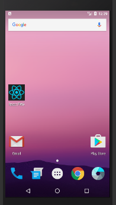
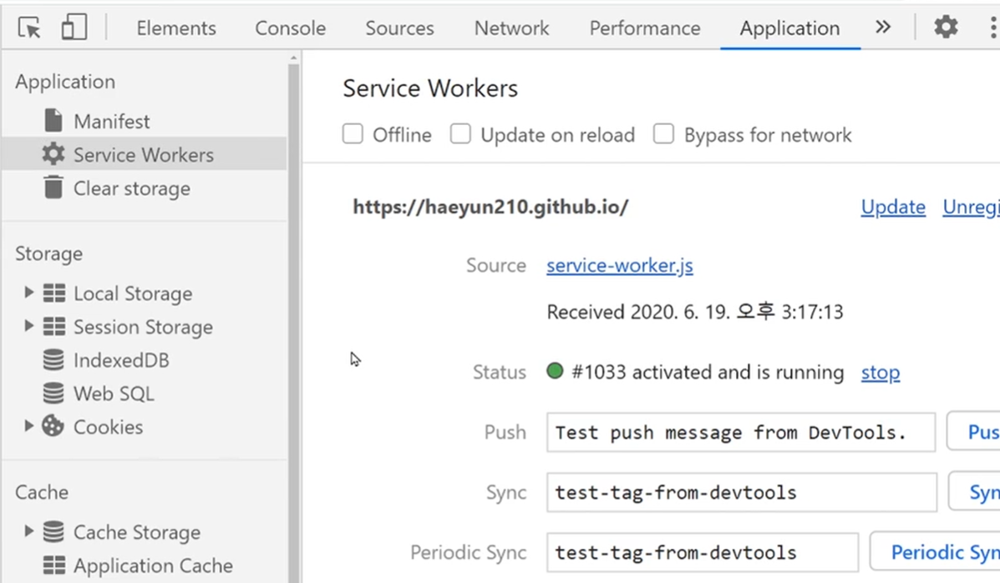

# PWA 셋팅해서 앱으로 발행
PWA
---
- Progressive Web App

- 웹사이트를 안드로이드/iOS 모바일 앱처럼 사용할 수 있게 만드는 일종의 웹개발 기술

- 리액트로 모바일 App 처럼 동작하는 사이트 만들어 둔 것을 모바일 앱으로 발행

    - iOS, Android 앱으로 발행하는게 아니라 웹사이트 자체를 스마트폰 홈화면에 설치

<br>

---

<Br>

웹사이트의 PWA화 장점
---

|-|
|-|
||

<br>

### 1. 스마트폰, 태블릿 바탕화면에 웹사이트 설치 가능

- 설치된 앱 누르면 상단 URL바가 제거된 크롬 브라우저 오픈

    - 일반 사용자는 앱이랑 구분 못함

<br>

### 2. 오프라인에서도 동작
- service-worker.js 라는 파일과 브라우저의 Cache storage 덕분

- 자바스크립트로 게임만들 때 유용

<br>

### 3. 설치 유도 비용이 매우 적음
- 앱설치를 유도하는 마케팅 비용이 적게들어 좋음

- 구글플레이 스토어 방문해서 앱 설치하고 다운받게 하는건 높은 마케팅비용 필요

- PWA라면 웹사이트 방문자들에게 간단한 팝업을 띄워서 설치유도 가능

    - 미국에선 PWA를 적극 이용하고 있는 쇼핑몰들 많음

<br>

---

<br>

PWA 발행 방법
---
- 아무사이트나 파일 2개만 사이트 로컬경로에 있으면 브라우저가 PWA로 인식

    - HTTPS 사이트여야함

- manifest.json과 service-worker.js 라는 이름의 파일 두개 필요

- 기본 프로젝트를 npm build / yarn build 했을 경우 manifest.json 파일만 생성

- service-worker.js 까지 자동으로 생성을 원한다면?

    - 프로젝트를 처음 만들 때 애초에 셋팅필요

> 터미널
```
npx create-react-app 프로젝트명 --template cra-template-pwa
```

<br>

### 프로젝트 재생성
- 다른 폴더에 위 명령어를 이용해 프로젝트 새로 하나 생성

- 기존 프로젝트의 App.js App.css index.js 이런 파일들을 새 프로젝트로 복붙 

    - index.js 파일은 많이 바뀐점이 좀 있어서 차이점 잘 복붙

- router, redux 등 라이브러리를 설치했다면 그것도 새프로젝트에서 다시 설치 

- index.js 하단 수정

- yarn build / npm run build

    - manifest.json과 service-worker.js 파일이 자동으로 생성

<br>

> index.js 하단 수정 전
```js
serviceWorkerRegistration.unregister();
```

<br>
 
> index.js 하단 수정 후
```js
serviceWorkerRegistration.register();
```

<br>

---

<br>

manifest.json / service-worker.js 파일 살펴보기
---
- build 후 build 폴더 내에 해당 파일들 존재

<br>

### manifest.json

- manifest.json 파일

    - 웹앱의 아이콘, 이름, 테마색 등을 결정하는 부분

    - version, scope 항목도 찾아보기

<br>

> manifest.json 
```json
{
  "version" : "여러분앱의 버전.. 예를 들면 1.12 이런거",
  "short_name" : "설치후 앱런처나 바탕화면에 표시할 짧은 12자 이름",
  "name" : "기본이름",
  "icons" : { 여러가지 사이즈별 아이콘 이미지 경로 },
  "start_url" : "앱아이콘 눌렀을 시 보여줄 메인페이지 경로",
  "display" : "standalone 아니면 fullscreen",
  "background_color" : "앱 처음 실행시 잠깐 뜨는 splashscreen의 배경색",
  "theme_color" : "상단 탭색상 등 원하는 테마색상",
}
```

<br>

- 웹앱에서 사용하는 모든 html 안에 아래 형식으로 연결
```html
<link rel="manifest" href="/manifest.webmanifest">
```
- 설치는 리액트가 알아서 해줬기 때문에 건드릴게 없음


<br>

### service-worker.js

- service-worker.js 파일

    - 서버에 요청하는게 아닌 하드에 이미 설치되어 있는걸 사용하는 방식을 흉내내도록 도와주는 파일

> ex
```
카카오톡 앱 설치할 때 구글플레이 스토어 가서 설치

그럼 카톡 구동에 필요한 이미지, 데이터들이 전부 하드에 설치됨

카톡을 켜면 카톡 로고 같은 데이터를 카톡 서버에 요청하는게 아니라

하드에 이미 설치되어 있는걸 그대로 가져와서 사용
```
 
- 이 파일에 설정을 잘 해주면 웹앱을 설치했을 때 CSS, JS, HTML, 이미지 파일이 하드에 설치될지 결정 가능

- 다음에 앱을 켤 때마다 서버에 CSS,JS,HTML 파일을 요청하는게 아니라 Cache Storage에 저장되어있던 CSS,JS,HTML 파일을 사용

    - 오프라인에서도 사용이 가능해짐

<br>

- 설정은 이미 되어있음

    - 기본 셋팅 : 모든 HTML CSS JS 파일을 cache storage에 저장

- 저장해두기 싫은, 자주변하는 파일들 있을 경우 튜토리얼 참고해 수정 가능

- service worker 파일을 만들고 싶다면?

    - 구글 공식 튜토리얼이나 크롬브라우저 권장 튜토리얼을 참고

    - service worker 제작에 필요한 문법이 따로 존재 

        - [공식 튜토리얼](https://developers.google.com/web/fundamentals/primers/service-workers)

        - [샘플](https://googlechrome.github.io/samples/service-worker/basic/)

 
<br>
 
- 홈페이지 업데이트할 때마다 유저들이 올드한 JS 파일을 사용하진 않을까 걱정 안해도 됨

    - build할 때마다 JS,CSS,HTML 파일의 이름과 경로가 무작위로 바뀜

    - 사이트에 필요한 JS,CSS,HTML 파일명이 바뀌면 하드에 있는게 아니라 서버에 요청해서 새로 받아옴

    - 파일을 서버에 올려서 배포할 때 마다 유저는 새로운 파일을 보게됨

<br>

---

<br>

개발자도구로 PWA 디버깅
---
- build 했던 프로젝트가 PWA인지 아닌지 살펴보려면

    - 사이트를 호스팅받아 올리기 (Github pages 도 OK)

    - VScode 익스텐션중에 live server 설치

        - build 폴더를 에디터로 오픈

        - 거기 있는 index.html을 우클릭 - live server로 띄우기 

- 사이트에서 크롬 개발자도구 → Application 탭

    - PWA와 관련된 모든걸 살펴볼 수 있음

<br>

|Application 탭|
|-|
||
- 사이트가 없으면 flipkart.com 이런 PWA 사이트 들어가서 따라해보기

<br>
 
- Manifest 메뉴

    - manifest.json 내용들 확인가능

- Service Worker 메뉴

    - service-worker 파일이 잘 있는지 확인 가능
    
    - 오프라인에선 잘 동작하는지 테스트 가능
    
    - 푸시알림 기능을 개발해놨다면 푸시알림도 샘플 전송 가능

- Cache Storage 메뉴

    - service-worker 덕분에 하드에 설치된 CSS, JS, HTML 파일들 확인 가능
    
    - 캐시된 파일 제거 가능

<br>

---

<br>

PWA를 커스터마이징
---
- PWA 발행이 쉽고 간단한 이유

    - 구글의 workbox 라이브러리 덕분

        - create-react-app 설치할 때 함께 설치되었기 때문

- PWA 발행방식 같은걸 커스터마이징 하고싶으면 workbox 사용법 필요

    - 구글 직원들의 개발문서는 매우 불친절하고 어렵움

<br>

- 개발문서 대신 빠르게 커스터마이징하는 방법

    - 하드에 설치할 파일 중에 HTML을 제외하고 싶다면?

        - HTML 파일은 너무 자주 변해서 하드에 저장해놓기 싫다면 여길 수정

            - 앱실행시 아무것도 안뜰꺼고 모바일 앱의 장점이 사라짐

<br>

- node_modules/react-scripts/config/webpack.config.js 파일

> 구버전
```js
new WorkboxWebpackPlugin.GenerateSW({
    clientsClaim: true,
    exclude: [/\.map$/, /asset-manifest\.json$/],
}) 
```

<br>

> 신버전
```js
new WorkboxWebpackPlugin.InjectManifest({
    swSrc,
    dontCacheBustURLsMatching: /\.[0-9a-f]{8}\./,
    exclude: [/\.map$/, /asset-manifest\.json$/, /LICENSE/], 
```
- exclude : 어떤 파일을 캐싱하지 않을건지 결정하는 부분

    - 정규식으로 작성하는데 정규식과 일치하는 파일명을 제외

    - 원하는 HTML 파일을 여기 등록

<br>

```js
new WorkboxWebpackPlugin.GenerateSW({
    clientsClaim: true,
    exclude: [/\.map$/, /asset-manifest\.json$/, /index\.html/],
}) 
```
- "모든 .css로 끝나는 파일",  "a라는 글자로 시작하는 파일" 등

- 사이트가 페이스북, 인스타, 유튜브처럼 입장과 동시에 Ajax로 초기데이터들을 전부 받아오는 사이트라면 필요없음

<br>

- 위처럼 코드를 추가하면 build 할 때 index.html 파일을 캐싱목록에서 제외

- PWA는 구글 앱스토어에 올릴 수 있는 apk 파일로 변환 가능 

    - PWAbuilder 이용

<br>

 

 
