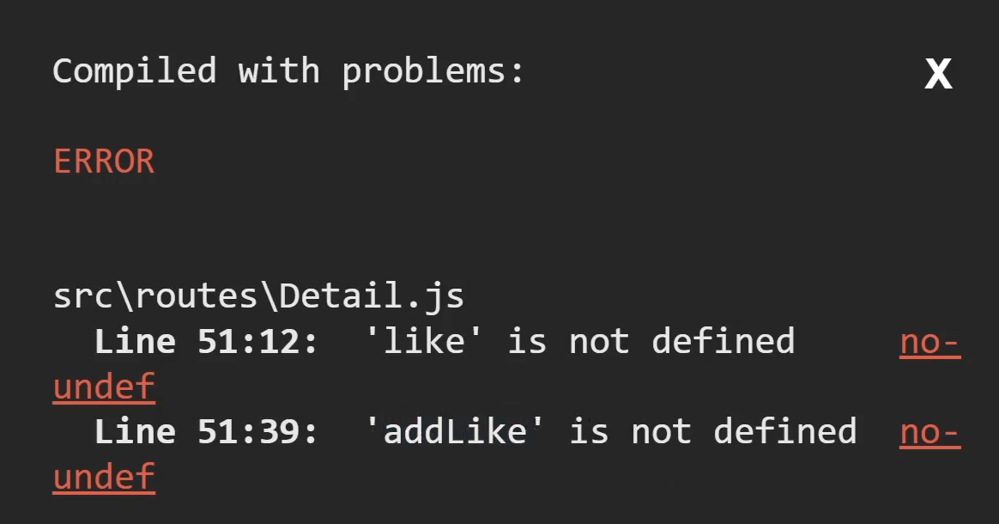

# custom hook으로 코드 재사용

좋아요 버튼 만들기
---
```js
function Detail(){
  let [like, setLike] = useState(0)
  
  return (
    (생략)
    <h4>{like}</h4>
    <button onClick={()=>{ setLike((a) => { return a + 1 }) }}>❤</button> 
  )
}
```
- state만들고 +1 버튼도 추가

<br>

### 💡 참고 
- state변경함수 사용할 때 안에 콜백함수를 넣을 수 있음

- 콜백함수안에 파라미터 하나 작명 가능 (위에선 a라고 작명함)

    - 기존 state값이 들어있음
    
        - 위처럼 코드짜도 like가 +1 

<br>

> 함수 사용
```js
function Detail(){
  let [like, setLike] = useState(0)
  function addLike(){
    setLike((a) => { return a + 1 })
  }
  
  return (
    (생략)
    <h4>{like}</h4>
    <button onClick={()=>{ addLike() }}>❤</button> 
  )
}
```
- function 문법

    - 길고 복잡한 코드를 한 단어로 치환해주는 문법

- 앞으로 addLike() 라고 쓰면 그 안에 있던 setLike 코드 실행

<br> 

- 문제 발생 가정

    - 방금 짰던 4줄의 자바스크립트 코드가 다른 컴포넌트에도 자주 필요해짐

- 해결 방법

    - 페이지마다 4줄의 코드를 복붙

    - 함수로 만들어서 재사용

<br>

---

<br>

4줄의 코드를 함수로 빼서 사용
---
> hooks/useLike.js
```js
export function useLike(){
  let [like, setLike] = useState(0)
  function addLike(){
    setLike((a) => { return a + 1 })
  }
} 
```
- 파일하나와 함수 하나 만들고 4줄의 코드를 담음

- 4줄의 코드가 필요한 곳마다 useLike() 작성

<br>

> Detail.js
```js
function Detail(){
  useLike()
  
  return (
    (생략)
    <h4>{like}</h4>
    <button onClick={()=>{ addLike() }}>❤</button> 
  )
}
```
- import 해서 사용

    - 에러 발생

        - like와 addLike라는 변수함수가 정의되지 않았다고 함

 
<br>

|-|
|-|
||

- like와 addLike는 useLike() 안에 잘 만들어놨는데 에러 발생한 이유?

  - 원래 함수안에 있던 변수는 함수 바깥에서 못씀

    - 변수의 범위 때문임

- 함수 안에 있던 변수들을 함수 바깥에서도 쓰고 싶으면 ?

  - 그 변수들을 함수 바깥으로 배출
  
    - 배출하려면 return 키워드 이용

<br>

> hooks/useLike.js
```js
export function useLike(){
  let [like, setLike] = useState(0)
  function addLike(){
    setLike((a) => { return a + 1 })
  }

  return [like, setLike]
} 
```
- return ~ 코드를 사용시 함수 실행하고난 자리에 ~ 반환

- like와 setLike를 반환하라고 코드 작성
 
<br>
 

> Detail.js
```js
function Detail(){
  let [a, b] = useLike()
  
  return (
    (생략)
    <h4>{a}</h4>
    <button onClick={()=>{ b() }}>❤</button> 
  )
}
```
- 함수 실행하면 그 자리에 [like, setLike] 반환

  - 그걸 destructuring 문법으로 각각 변수에 저장해서 사용

    - a, b 변수라고 작명해서 거기 저장함

- 함수 안에 있던 변수들을 바깥에서도 사용가능합

<br>

---

<br>

custom hook
---
> hooks/useLike.js
```js
export function useLike(){
  let [like, setLike] = useState(0)
  function addLike(){
    setLike((a) => { return a + 1 })
  }

  return [like, setLike]
} 
```
- useState, useEffect 등의 코드를 담고있는 함수 작명할 때는 use 붙이기

  - 해당 코드는 컴포넌트 함수 안에만 작성해야 함

    - 실수로 html 안에 넣거나 if문 안에 넣는 상황 방지를 위해


- useState, useEffect 이런걸 hook이라고 부름

  - useState, useEffect 등을 담고 있는 함수 : custom hook

- 코드들을 custom hook으로 만들어서 사용해보기

  - 굳이 재사용이 필요없어도 연습삼아서 한번 해보기

- react query같은 것들도 코드가 좀 길고 재사용 잦음

  - custom hook으로 만들어놓고 재사용하는 경우 多

<br>

---

<br>

혼자 해보기
---
### 1. 서버에서 이름을 가져와서 html에 보여주는 코드 작성
- 다른 페이지에서도 자주 사용할 것 같으니 함수로 빼서 사용

- 서버가 없기 때문에 public 폴더에 username.json 파일 생성

  - 그 파일엔 "Kim"이라는 단어하나를 저장

    - /username.json으로 GET 요청시 "Kim"을 가져올 수 있음

```js
 export function useUsername(){
  let [username, setUsername] = useState('');
  useEffect(()=>{
    axios.get('/username.json').then((r)=>{
      setUsername(r.data)
    })
  },[])
  return username;
} 
```
- 함수 만들놓고 원하는 곳에서 useUsername() 을 사용

- 유저 이름을 못가져오거나 실패하는 경우엔 뭘 보여줄지 예외상황 처리 진행

<br>

 
### 2. 컴포넌트 안에 있는 코드들이 길고 복잡하다면 함수로 빼서 사용
- 굳이 재사용안하는 코드도 그냥 길어서 함수로 빼는 경우도 多

<br>