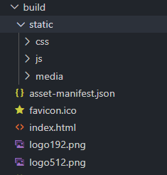
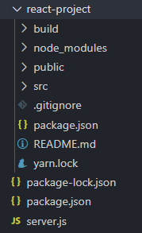

# Node+Express 서버와 React 연동
- 서버는 유저가 메인페이지로 접속하면 리액트로 만든 html 파일을 보내주면 연동 끝 

<br>

---

<br>

서버
---
- 누가 html 파일 요청하면 보내주는 프로그램

- Nodejs + Express로 임시 서버 만들기

    1. 구글검색해서 nodejs 설치

    2. 작업폴더만들고 에디터로 오픈

    3. server.js 파일을 만들고 아래 코드 작성

    4. 터미널을 열어서 npm init -y 입력 

    5. npm install express 입력  

<br>

> server.js
```js
const express = require('express');
const path = require('path');
const app = express();

app.listen(8080, function () {
  console.log('listening on 8080')
}); 
```

<br>
 

- 서버 미리보기 띄우고 싶으면 터미널열어서 `nodemon server.js` 입력

    - nodemon 없으면 `node server.js` 입력
 
<br>

---

<br>

리액트
---
- HTML을 이쁘게 만들어주는 툴

- 앱처럼 부드럽게 동작하는 html을 만들고 싶을 때 사용하는 툴
 

<br>


> ex. 카톡 같은 모바일 앱 

|-|
|-|
||

- 새로고침 없이 페이지 전환

    - 새로고침할 없이 부드럽게 전환되는 사이트(Single Page Application) 만들 때 리액트 사용

        - 자바스크립트로도 가능한데 코드 길어져서 리액트 사용

<br>

---

<br>
 

리액트 프로젝트 만드는 법 
---
- server.js 옆에 서브폴더로 리액트 프로젝트 생성

    0. 구글 검색해서 nodejs 최신버전 설치

    1. 터미널에 `npx create-react-app 프로젝트명` 입력

        - 프로젝트명 자유 작명(띄어쓰기 X) 

    2. 서브폴더에 리액트 프로젝트가 생성되면 에디터로 오픈

    3. 리액트 문법으로 만들고 싶은걸 개발

        - 개발시 코드를 미리보고 싶으면 `npm run start` 입력

    4. 개발 완료되면 리액트 프로젝트 터미널에 `npm run build` 입력

        - 리액트 완성본 html 파일이 build 폴더내에 생성됨

        - 생성된 html 파일을 서버에서 필요할 때 유저에게 보내줌

<br>

---

<br>

리액트로 만든 HTML 전송하는법 
---
- 서버 언어 상관없이 리액트로 개발한 html파일을 고객에게 보내주면 서버랑 리액트 연동 끝 

<br>

|-|
|-|
||
|리액트 개발 후 `npm run build` 하면 build 폴더 생성<br> → 폴더 내 html, css, js 파일 생성|

- html 파일은 index.html 파일 딱 하나 

    - 기본적인 리액트 프로젝트는 SPA 만들어줌

        - SPA는 기본적으로 html 파일 하나만 사용

<br>

> server.js
```js

누군가 메인페이지로 접속하면 리액트로 build한 index.html 보내주세요
```
- 서버에 이렇게 코드 짜면 리액트와 Nodejs 서버 합치기 끝

<br>

> ex

|폴더구조|
|-|
||
|server.js 옆에다가 react-project 폴더명으로 리액트 프로젝트 생성한 것<br>→ 안에 build한 파일들 존재|


> 위와 같은 경우 server.js
```js
app.use(express.static(path.join(__dirname, 'react-project/build')));

app.get('/', function (요청, 응답) {
  응답.sendFile(path.join(__dirname, '/react-project/build/index.html'));
});
```
- `express.static` : 특정 폴더안의 파일들을 static 파일로 고객들에게 보내줄 수 있음

    - build 폴더 안의 css, js, img 파일들도 사용 가능

- 누군가 / 페이지로 접속하면 리액트로 만든 html 보내줌

    - localhost:8080 접속시 리액트 프로젝트 오픈

<br>

---

<br>

리액트에서 라우팅을 담당하는 경우?
---
- 라우팅

    - 서버에서 라우팅을 담당

    - 리액트에서 라우팅을 담당
    
        - `react-router-dom` 설치

- 리액트 라우터로 /list 페이지 개발 후 localhost:8080/list 로 직접 URL 입력해서 접속시 아무것도 안뜸

    - 브라우저 URL창에 적는건 서버에게 요청하는것
    
        - 리액트 라우터에게 라우팅 요청하는게 아님

    - 리액트가 라우팅하게 전권을 넘기려면 server.js 수정

<br>

> server.js
```js
app.get('*', function (요청, 응답) {
  응답.sendFile(path.join(__dirname, '/react-project/build/index.html'));
});
```
- 별표 * : 모든 문자라는 뜻

- `고객이 URL란에 아무거나 입력하면 리액트 프로젝트 보내달라`는 뜻

    - 이렇게 하면 리액트 라우팅 잘됨

- 이 코드는 항상 **가장 하단**에 놓아야 잘 작동

<br>

---

<br>
 

리액트에서 DB데이터 보여주고 싶으면? 
---
- DB에서 글목록 데이터를 꺼내서 HTML로 보여주고 싶은 경우

    - server-side rendering : html을 서버가 만들어서 보내주는 것

        1. DB에서 데이터 뽑아서

        2. 글목록.html 파일에 꽂아넣고

        3. 그 html 파일을 서버에서 보내주는 것

    - client-side rendering : html을 리액트가 브라우저안에서 만드는 것

        1. 리액트가 서버에 GET요청으로 DB데이터를 가져와서

        2. 그걸 html로 만들어서 보여주는 것

        3. 리액트를 쓰는 경우 보통 사용하는 방식

<br>

- DB에 있는 상품목록을 가져와서 리액트에서 보여주는 코드

    1. 서버는 누군가 /product로 GET요청을 하면 DB에서 데이터 꺼내서 보내주라고 API를 짜놓음 

    2. 리액트는 상품목록을 보여주고 싶을 때 서버 /product 주소로 GET요청

    3. 받아온 데이터 가지고 html에 집어넣든 등 원하는 방식으로 개발
 
<br>

- 리액트는 서버와의 통신은 거의 ajax로 진행

- POST요청, 로그인해서 세션만들기 등도 ajax로 잘됨

- nodejs 서버파일 상단에 특정 코드 넣고 시작해야 리액트와 nodejs 서버간 ajax 요청 잘됨

<br>

> server.js
```js
app.use(express.json());
var cors = require('cors');
app.use(cors());
```
- express.json() : 유저가 보낸 array/object 데이터를 출력해보기 위해 필요

- cors : 다른 도메인주소끼리 ajax 요청 주고받을 때 필요

<br>

---

<br>
 

리액트프로젝트 코드 수정할 때 마다 build 작업 필수? 
---
- 그럴 필요 X

- 사이트를 aws, google cloud 등에 발행할 때만 한 번 해주면 됨

- 평소에 개발할 땐 리액트도 localhost로 미리보기 띄워놓고, 서버도 localhost로 미리보기를 띄워두고 개발 진행하면 별 문제 X

- 리액트 → 서버 ajax 요청시 /product 말고 http://서버주소/product 입력

    - 리액트에서 package.json 파일을 열어서 proxy 설정 수정 방법도 존재

        - 서버 미리보기 띄우던 localhost:oooo 주소로 설정

        - 리액트에서 ajax 요청 대충해도 localhost:oooo 주소로 ajax 요청을 알아서 보내줌

        - [참고](https://create-react-app.dev/docs/proxying-api-requests-in-development/)


- 서버에 cors 옵션 켜놓기

 
<br>

---

<br>

서브디렉토리에 리액트앱 발행하고 싶은 경우 
---
- /react 접속하면 리액트로 만든 html, / 접속하면 public 폴더에 있던 main.html 띄우려면?


<br>

> server.js
```js
app.use( '/', express.static( path.join(__dirname, 'public') ))
app.use( '/react', express.static( path.join(__dirname, 'react-project/build') ))

app.get('/', function(요청,응답){
  응답.sendFile( path.join(__dirname, 'public/main.html') )
}) 
app.get('/react', function(요청,응답){
  응답.sendFile( path.join(__dirname, 'react-project/build/index.html') )
})
```
- server.js 라우팅 수정

 
<br>
 

> 리액트프로젝트 내의 package.json
```js
{
  "homepage": "/react",
  "version": "0.1.0",
  ... 등
} 
```
- package.json에 homepage 항목을 발행 원하는 서브디렉토리명으로 새로 기입 

<br>
 

 
